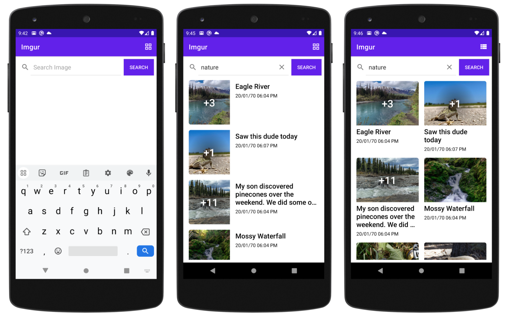

# Imgur Sample App #
This is just a sample project to demonstration purpose.

## Getting Started
These instructions will get you a copy of the project up and running on your local machine for development and testing purposes with the guideline for best practices.

## Prerequisites
For development, the latest version of Android Studio Electric Eel with Java 11 is required.

## Installing
Open Android studio and take a clone through the repo url found in your gitlab account after share the project by Its owner or Admin 

eg:- `https://github.com/devendroid/imgur-sample.git`

## Directory Structure
```
📂com.devs.imgur
 └───ImgurActivity
 └───ImgurApplication
 |───📂util  
 |───📂di  
 |───📂data
 |───📂ui
─────────────────────────────────────── 
📂com.devs.imgur
 └───ImgurActivity
 └───ImgurApplication
 |───📂util  
 |───📂di  
 |───📂data
 |   └────📂repository
 |   └────📂source 
 |   |     └────📂local 
 |   |     └────📂network 
 |   |    |──policy.dart
 |   |    |──pest_client.dart
 |   |    |──rest_client.g.dart
 |   |    |──perver_error.dart 
 |   └────📂dto
 |───📂ui
 |    └────📂home
 |    └────📂search 
```

## Screenshots



## Libraries Used
In this branch you'll find:
* User Interface with **View Binding**
* A single-activity architecture.
* A presentation layer that contains Screen (View) and a **ViewModel** per screen.
* Reactive UIs using **LiveData** to Build data objects that notify views when the underlying data changes.
* Asynchronous operations using **Coroutines**
* A **data layer** with a repository and two data sources (local using Room and a remote).
* Dependency injection using **Hilt**
* Using **Timber** fo logging
* **Retrofit** for network calling
* **Moshi** to process JSON
* **Coil** for image loading

## App Architecture
This sample app structure is based on Google developer recommended app architecture with common architectural principles like,  
- Separation of concerns
- Drive UI from data models
- Unidirectional Data Flow  

Application having two main Layer:  
- The **UI Layer** that displays application data on the screen.
- The **Data Layer** that contains the business logic of your app and exposes application data.

We can add an additional layer called the Domain Layer to simplify and reuse the interactions between the UI and data layers (Current sample does not included this layer).


